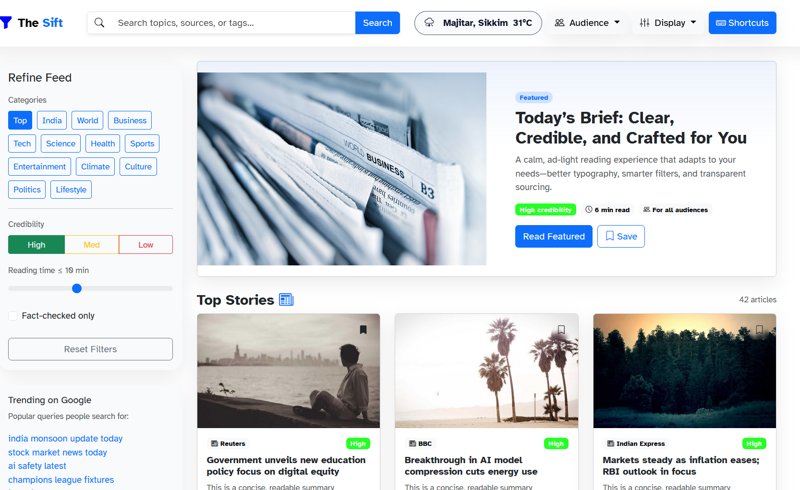
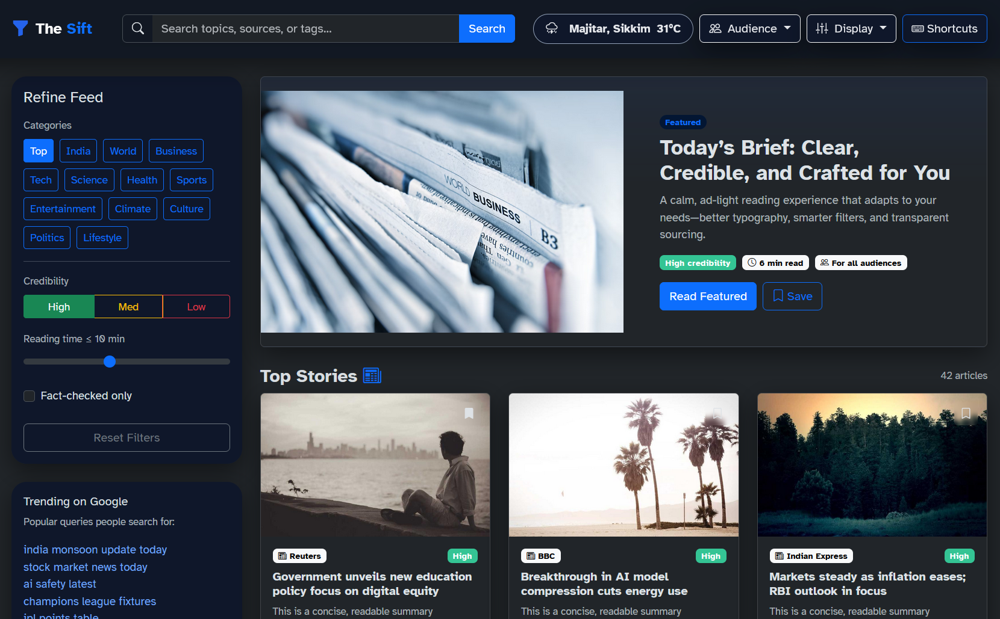

# 📰 The Sift  
*Cutting through the noise, delivering truth.*  

## 🚀 Overview  
**The Sift** is a reimagined news platform designed during the **UI/UX Sprint Hackathon** to solve a pressing problem in modern journalism: **cluttered, ad-heavy, and inaccessible news sites that erode trust and overwhelm readers.**  

By “sifting” through the chaos, The Sift delivers **verified, accessible, and reader-first news** that balances **readability, credibility, and inclusivity** for diverse audiences — from **students and professionals** to **elderly readers** seeking clarity.  

---

## 🎯 Problem  
Most news sites today are plagued by:  
- 🧱 **Overwhelming interfaces** filled with ads, clickbait, and clutter.  
- 🤯 **Poor readability** due to dense text and inconsistent layouts.  
- 🚫 **Accessibility gaps** that alienate elderly readers, people with visual impairments, or those with dyslexia.  
- ❌ **Credibility concerns**, as misinformation spreads faster than truth.  

---

## 💡 Our Solution  
**The Sift** redefines how news is experienced:  

- ✨ **Clean, distraction-free design** – minimal ads, whitespace-driven layout, and typography tuned for readability.  
- 🌍 **Audience presets** – optimized modes for **students, professionals, and elderly readers**.  
- 🕶️ **Accessibility-first** – high-contrast toggle, dyslexia-friendly font, scalable text.  
- ✅ **Credibility badges** – highlight sources and trust scores at a glance.  
- 📌 **Smart bookmarking** – readers save articles (stored in localStorage).  
- ⌨️ **Keyboard shortcuts & quick navigation** for power users.  
- 📊 **Density & readability controls** – adjust article presentation to match preference.  

---

## ✨ Key Features  
- 🔍 **Filter & search bar** for personalized browsing.  
- 📚 **Reader mode** with progress bar for distraction-free immersion.  
- 🖤 **Dark & light themes** for comfort.  
- 🕰️ **Seamless navigation** with smooth animations & shadows.  
- 📱 **Fully responsive** – optimized for desktop, tablet, and mobile.  

---

## 🛠️ Tech Stack  
- **Frontend**: HTML5, CSS3, Bootstrap 5, Vanilla JavaScript  
- **Design Principles**: Accessibility, Minimalism, Inclusivity, Performance  
- **State Management**: Browser `localStorage` for bookmarks & preferences  

---

## 🎨 Design Philosophy  
> *"Good design is invisible — it lets the content shine."*  

The Sift prioritizes **clarity and trust** over flashy gimmicks. Every design choice was validated against three pillars:  
1. **Readability** – Typography, spacing, and layouts reduce cognitive load.  
2. **Accessibility** – Color contrast, font choices, and UI modes ensure inclusivity.  
3. **Credibility** – Clean presentation builds trust in journalism.  

---

## 📸 Screenshots  

Here are some glimpses of **The Sift** in action:  

<div align="center">

<table>
  <tr>
    <td align="center">
      🏠 <b>Home Page</b><br>
      
    </td>
   

  <tr>
    <td align="center">
      🌙 <b>Dark Mode</b><br>
      
    </td>
  </tr>
</table>
</div>


---

## 📂 Project Structure  
```bash
The-Sift/
│── index.html   
│── README.md
│── style.css
│── script.js
 
